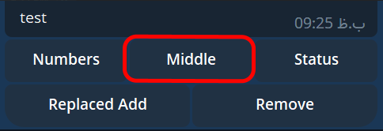

# tg-keyboard
A keyboard builder for Telegram Api & Mtproto syntax
<div id="top"></div>

<!-- TABLE OF CONTENTS -->
<details>
  <summary>Table of Contents</summary>
  <ol>
    <li><a href="#installation">Installation</a></li>
    <li>
        <a href="#usage">Usage</a>
        <ol>
            <li><a href="#defining-a-keyboard">Defining a Keyboard</a></li>
            <li><a href="#defining-buttons">Defining Buttons</a></li>
            <li>
                <a href="#bind-buttons-to-a-keyboard">Bind Buttons to a Keyboard</a>
                <ol>
                    <li><a href="#by-row">By Row</a></li>
                    <li><a href="#by-button">By Button</a></li>
                    <li><a href="#by-coordinates">By Coordinates</a></li>
                    <li><a href="#as-stack">As Stack</a></li>
                </ol>
            </li>
            <li><a href="#keyboardforcereply-and-keyboardhide">KeyboardForceReply and KeyboardHide</a></li>
            <li><a href="#keyboard-peer-type">Keyboard Peer Type</a></li>
            <li><a href="#convert-keyboards">Convert To Api & Mtproto Keyboard (and the opposite)</a>
                <ol>
                    <li><a href="#telegram-api">Telegram API</a></li>
                    <li><a href="#mtproto">Mtproto</a></li>
                </ol>
            </li>
        </ol>
    </li>
  </ol>
</details>

## Installation

Install the package using composer:

```shell
composer require reymon/tg-keyboard
```

<p align="right">(<a href="#top">back to top</a>)</p>

## Usage

If you need to create a keyboard you can use the classes provided by this package as a drop-in replacement.

This is best explained with an example:

```php
KeyboardMarkup::new()
        ->singleUse()
        ->addButton(KeyboardButton::Text('Cancel'))
        ->addButton(KeyboardButton::Text('OK'));
```

A ReplyKeyboardMarkup is created by calling the static `new()` method on `KeyboardMarkup`. After that every field,
like `singleUse`, ... add some extras. Buttons can be added by calling
the `addButton()` method. We have a detailed look on that later.

<p align="right">(<a href="#top">back to top</a>)</p>

### Defining a Keyboard

You can create a keyboard by calling the static `new()` method on its class.

After that you can chain methods to set additional fields that are available in the Bot API. This is done by calling the
`placeholder()` method.

```php
KeyboardMarkup::new()
    ->placeholder('Placeholder');
```

<p align="right">(<a href="#top">back to top</a>)</p>

### Defining Buttons

The Buttons are created in the different way:

```php
$button = KeyboardButton::Phone('Send my Contact');
$button->getText();
$button->setText('Give me contact');
```

This is done the same way for `InlineButton`:

```php
$button = InlineButton::Url('hello','https://example.com');
$button->getUrl();
$button->setUrl('github.com');
```

<p align="right">(<a href="#top">back to top</a>)</p>

### Bind Buttons to a Keyboard

The keyboard does not work without any buttons, so you need to pass the buttons to the keyboard. There are a few ways to
do this.

#### By Row

```php
KeyboardMarkup::new()
    ->row(
        KeyboardButton::Text('Cancel'),
        KeyboardButton::Text('OK')
    );
```

If you need more than one row, call `row()` multiple times:

```php
KeyboardInline::new()
    ->row(
        InlineButton::Callback('1', 'page-1'),
        InlineButton::Callback('2', 'page-2'),
        InlineButton::Callback('3', 'page-3')
    )
    ->row(
        InlineButton::Callback('prev', 'page-prev'),
        InlineButton::Callback('next', 'page-next')
    );
```
You can add array of callbacks or texts keyboard in another way!
```php
KeyboardInline::new()
    ->addCallbacks([
        '1' => 'page-1',
        '2' => 'page-2',
        '3' => 'page-3',
    ],[
        'prev' => 'page-prev',
        'next' => 'page-next'
    ]);
```
```php
KeyboardMarkup::new()
    ->addTexts([
       'Cancel',
       'Ok'
    ]);
```
You can even use these methods

for InlineKeyboard:

* [addCallback](src/Keyboard/KeyboardInline.php#L37)
* [addCallbacks](src/Keyboard/KeyboardInline.php#L47)
* [addCopyText](src/Keyboard/KeyboardInline.php#L62)
* [addUrl](src/Keyboard/KeyboardInline.php#L73)
* [addWebApp](src/Keyboard/KeyboardInline.php#L84)
* [addLoginUrl](src/Keyboard/KeyboardInline.php#L98)
* [addGame](src/Keyboard/KeyboardInline.php#L108)
* [addBuy](src/Keyboard/KeyboardInline.php#L118)
* [addSwitchInline](src/Keyboard/KeyboardInline.php#L129)
* [addSwitchInlineCurrent](src/Keyboard/KeyboardInline.php#L140)
* [addSwitchInlineFilter](src/Keyboard/KeyboardInline.php#L155)
  
and for ReplyKeyboard:

* [addText](src/Keyboard/KeyboardMarkup.php#L74)
* [addTexts](src/Keyboard/KeyboardMarkup.php#L84)
* [addWebApp](src/Keyboard/KeyboardMarkup.php#L99)
* [requestPoll](src/Keyboard/KeyboardMarkup.php#L109)
* [requestPollQuiz](src/Keyboard/KeyboardMarkup.php#L119)
* [requestPollRegular](src/Keyboard/KeyboardMarkup.php#L129)
* [requestLocation](src/Keyboard/KeyboardMarkup.php#L139)
* [requestPhone](src/Keyboard/KeyboardMarkup.php#L149)
* [requestUsers](src/Keyboard/KeyboardMarkup.php#L166)
* [requestGroup](src/Keyboard/KeyboardMarkup.php#L186)
* [requestChannel](src/Keyboard/KeyboardMarkup.php#L205)

#### By Button

```php
KeyboardMarkup::new()
    ->addButton(KeyboardButton::Text('First Button'))
    ->addButton(KeyboardButton::Text('Second Button'));
```

If you need more than one row, just call the row method without arguments, and continue calling `addButton()`:

```php
KeyboardInline::new()
    ->addButton(
        InlineButton::Callback('A','answer-a'),
        InlineButton::Callback('B','answer-b')
    )
    ->row()
    ->addButton(
        InlineButton::Callback('C', 'answer-c'),
        InlineButton::Callback('D', 'answer-d')
    );
```

It's up to you if you define your buttons inline like in these examples or if you'd like to generate a whole row beforehand and
pass the variable to the `row()` method.

You can remove the last button by calling `remove` method here is an example :

```php
KeyboardInline::new()
    ->addButton(InlineButton::Callback('A', 'answer-a'))
    ->addButton(InlineButton::Callback('B', 'answer-b'))
    ->row()
    ->addButton(InlineButton::Callback('C', 'answer-c'))
    ->addButton(InlineButton::Callback('D', 'answer-d'))
    ->remove();
```
In this example button D will remove from buttons.

#### By Coordinates

You can add button to each coordinates you want! (Note that coordinates start from 0 just like array indexes.)
for example imagine we have this keyboard :
```php
$keyboard = KeyboardInline::new()
    ->addButton(InlineButton::Callback('Numbers', 'Numbers'))
    ->addButton(InlineButton::Callback('Status', 'Status'))
    ->row()
    ->addButton(InlineButton::Callback('Add', 'Add'))
    ->addButton(InlineButton::Callback('Remove', 'Remove'));
```
we can add new button with it coordinates(raw and column) by calling `addToCoordinates` method.
This methods will add new button in the coordinate that you passed and shift next buttons of the coordinates.
This picture show you the position of new button :


```php
$keyboard->addToCoordinates(0, 1, InlineButton::Callback('Middle','Middle'));
```
The results should like this image :



You can also replace into specific coordinates unlike `addToCoordinates` the `replaceIntoCoordinates` method will replace
your new button into passed coordinate for example if we want to replace Add in this example like this picture :


we should use this code :

```php
$keyboard->replaceIntoCoordinates(1, 0, InlineButton::Callback('Replaced Add','Add'));
```
The result should like this image :


You can also remove the button by it's coordinates for example if we want remove Add button(in last example) 
we should run this code:

```php
$keyboard->removeFromCoordinates(1,0);
```

#### As Stack

If you want to add a bunch of buttons that have each a row for themselves you can use the `Stack()` method.

```php
KeyboardInline::new()
    ->Stack(
        InlineButton::LoginUrl('Login','https://example.com/login'),
        InlineButton::Url('Visit Homepage','https://example.com')
    );
```


**You can mix and match the `row()`, `Stack()` and `addButton()` methods as it fits your needs.**

<p align="right">(<a href="#top">back to top</a>)</p>

### KeyboardForceReply and KeyboardHide

KeyboardForceReply and KeyboardHide can be used the same way as a normal keyboard, but they do not receive any buttons:

```php
$keyboard = KeyboardHide::new();
```

```php
KeyboardForceReply::new()
    ->addButton(KeyboardButton::Text('Hello please reply'))
    ->placeholder('must reply');
```

<p align="right">(<a href="#top">back to top</a>)</p>

### Keyboard Peer Type

We have 3 types of peer type can be requested by bots RequestUsers , RequestGroup and RequestChannel

```php
KeyboardMarkup::new()
    ->addButton(KeyboardButton::PeerUsers('Request for user', 0, bot: false));
```
```php
KeyboardMarkup::new()
    ->addButton(KeyboardButton::PeerGroup('Request for chat', 1));
```
```php
KeyboardMarkup::new()
    ->addButton(KeyboardButton::PeerChannel('Request for channel', 2));
```
**You can also use easier syntax to create better one**

```php
KeyboardMarkup::new()
    ->requestUsers('Request for user', 0);
```
```php
KeyboardMarkup::new()
    ->requestGroup('Request for chat', 1);
```
```php
KeyboardMarkup::new()
    ->requestChannel('Request for broadcast', 2);
```
<p align="right">(<a href="#top">back to top</a>)</p>

### Convert Keyboards

You can now easily convert telegram keyboards for modify and ...
using `fromBotApi` or `fromMtproto` (for [MadelineProto](https://docs.madelineproto.xyz/)) methods!

Here is an example

(for now `fromBotApi` only accepts inline keyboards)

#### **Telegram API**

```php
$keyboard = Keyboard::fromBotApi([
    "inline_keyboard": [
        [
            ["text" => "Callback data", "callback_data" => "Some data"]
        ],
        [
            [ "text" => "Hide keyboard", "callback_data" => "HIDE"]
        ]
    ]
]);
$keyboard->addButton(InlineButton::Callback('End','End'));
// Convert to mtproto syntax
$keyborad->toMtproto();
```

#### **Mtproto**
```php
$keyboard = Keyboard::fromMtproto([
    '_' => 'replyInlineMarkup',
    'rows' => [
        [
            '_' => 'keyboardButtonRow',
            'buttons' => [
                ['_' => 'keyboardButtonCallback', 'text' => '1', 'data' => '0'],
                ['_' => 'keyboardButtonCallback', 'text' => '2', 'data' => '1'],
                ['_' => 'keyboardButtonCallback', 'text' => '🟢', 'data' => 'stat'],
                ['_' => 'keyboardButtonCallback', 'text' => '3', 'data' => '2'],
                ['_' => 'keyboardButtonCallback', 'text' => '4', 'data' => '3']
            ]
        ],
        [
            '_' => 'keyboardButtonRow',
            'buttons' => [
                ['_' => 'keyboardButtonCallback', 'text' => '10', 'data' => '9'],
                ['_' => 'keyboardButtonCallback', 'text' => '11', 'data' => '10'],
                ['_' => 'keyboardButtonCallback', 'text' => '12', 'data' => '11'],

            ]
        ],
        [
            '_' => 'keyboardButtonRow',
            'buttons' => [
                ['_' => 'keyboardButtonCallback','text' => '13', 'data' => '12'],
                ['_' => 'keyboardButtonCallback','text' => '14', 'data' => '13']
            ]
        ]
    ],
]);
$keyboard->addButton(InlineButton::Callback('15','14'));
// Convert to telegram api syntax
$keyborad->toApi();
json_encode($keyborad);
```

As you know `$keyboard` is object here and you can modify and add more buttons to it.
Or event iterate it!:

```php
foreach ($keyboard as $row) {
    foreach ($row as $button) {
        printf("Text: %s Callback: %s", $button->getText(), $button->getCallback());
    }
}
```
<p align="right">(<a href="#top">back to top</a>)</p>
